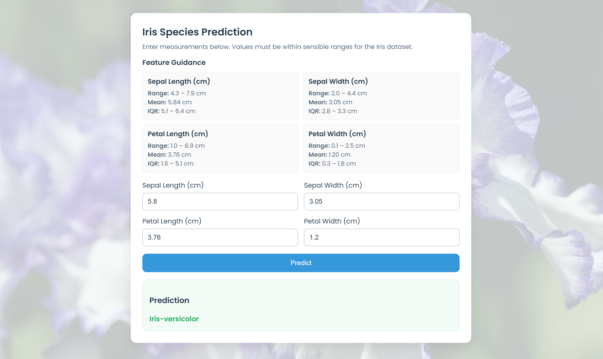

# 🌸 **Flask Application — MLOps Iris Classifier**

This branch builds upon the **model training stage** by introducing a **Flask web application** that serves the trained Decision Tree model through an interactive user interface.
It represents the **third executable workflow stage** of the **MLOps Iris Classifier** pipeline — transforming the trained model into an accessible web app for live predictions.

<p align="center">
  
</p>

## 🧩 **Overview**

This stage introduces three new components:

* **`app.py`** — Flask backend serving the trained model and handling predictions
* **`templates/index.html`** — Responsive HTML interface for user inputs and prediction results
* **`static/style.css`** — Front-end styling and visual design, including background image overlay

Together, these files create a **fully functional web application** that allows users to input Iris measurements, see guidance on valid feature ranges, and receive real-time species predictions.

### 🔍 Core Responsibilities

| Stage | Component                           | Description                                                                                            |
| ----: | ----------------------------------- | ------------------------------------------------------------------------------------------------------ |
|   1️⃣ | **`app.py`**                        | Loads the trained model (`model.pkl`), handles routes, processes form inputs, and returns predictions. |
|   2️⃣ | **`templates/index.html`**          | Provides a dynamic, user-friendly web interface with guidance on valid measurement ranges.             |
|   3️⃣ | **`static/style.css`**              | Controls overall styling, typography, layout, responsiveness, and background visuals.                  |
|   4️⃣ | **`static/img/app_background.jpg`** | Adds a faint background image overlay (20% opacity) for visual polish.                                 |

## 🗂️ **Updated Project Structure**

```text
mlops_iris_classifier/
├── .venv/                          # 🧩 Local virtual environment (created by uv)
├── app.py                          # 🌐 Flask web application entry point
├── artifacts/
│   ├── raw/
│   │   └── data.csv                # 🌸 Input Iris dataset
│   ├── processed/                  # 💾 Preprocessed data artefacts
│   │   ├── X_train.pkl
│   │   ├── X_test.pkl
│   │   ├── y_train.pkl
│   │   └── y_test.pkl
│   └── models/                     # 🧠 Trained model and evaluation outputs
│       ├── model.pkl
│       └── confusion_matrix.png
├── img/
│   └── flask/
│       └── flask_app.png           # 🖼️ Screenshot of the running Flask app
├── mlops_iris_classifier.egg-info/ # 📦 Package metadata (auto-generated)
├── pipeline/                       # ⚙️ Future Kubeflow pipeline integration
├── src/
│   ├── __init__.py
│   ├── custom_exception.py         # Unified error handling
│   ├── logger.py                   # Centralised logging
│   ├── data_processing.py          # 🌱 Data preparation workflow
│   └── model_training.py           # 🌳 Model training and evaluation workflow
├── static/                         # 🎨 CSS and visual assets for Flask UI
│   ├── style.css                   # Core stylesheet
│   └── img/
│       └── app_background.jpg      # Background image overlay
├── templates/                      # 🧩 HTML templates for the Flask app
│   └── index.html                  # Web interface for input and prediction
├── .gitignore                      # 🚫 Git ignore rules
├── .python-version                 # 🐍 Python version pin
├── pyproject.toml                  # ⚙️ Project metadata and uv configuration
├── requirements.txt                # 📦 Python dependencies
├── setup.py                        # 🔧 Editable install support
└── uv.lock                         # 🔒 Locked dependency versions
```

## ⚙️ **How to Run the Flask App**

Before running the web application, ensure:

1. The virtual environment is activated.
2. The trained model exists under `artifacts/models/model.pkl`.
3. Dependencies from `requirements.txt` are installed.

Then launch the app with:

```bash
python app.py
```

### ✅ **Expected Successful Output**

```console
 * Running on http://127.0.0.1:5000 (Press CTRL+C to quit)
 * Restarting with stat
 * Debugger is active!
 * Debugger PIN: 194-873-654
```

Access the app at **[http://localhost:5000](http://localhost:5000)** to interact with the prediction interface.

## 🧠 **User Interface Highlights**

* **Feature Guidance Panel** — Displays feature statistics (range, mean, IQR) for each measurement, helping users stay within valid input ranges.
* **Validated Numeric Inputs** — Prevents invalid values (e.g., negatives or out-of-range entries).
* **Predefined Suggestions** — Each input field includes datalist hints (mean, quartile values, etc.) for quick selection.
* **Full-Width Predict Button** — Prominently displayed at the bottom of the form for clear usability.
* **Dynamic Background** — Lightly transparent overlay using `app_background.jpg` for professional polish.
* **Responsive Design** — Scales gracefully for mobile and desktop devices.

## 🧩 **Integration Summary**

| File                            | Purpose                                                          |
| ------------------------------- | ---------------------------------------------------------------- |
| `app.py`                        | Flask server for handling routes, requests, and predictions.     |
| `templates/index.html`          | Dynamic HTML page for user interaction and result display.       |
| `static/style.css`              | Stylesheet defining layout, fonts, grids, and responsive design. |
| `static/img/app_background.jpg` | Subtle background image providing depth and contrast.            |
| `artifacts/models/model.pkl`    | Trained model loaded into Flask for live inference.              |

## 💡 **Example Workflow**

1. Run the data preparation module:

   ```bash
   python src/data_processing.py
   ```

2. Train the model:

   ```bash
   python src/model_training.py
   ```

3. Launch the Flask app:

   ```bash
   python app.py
   ```

4. Open your browser and navigate to **[http://localhost:5000](http://localhost:5000)**.
   Input sepal and petal measurements to receive a real-time Iris species prediction.

## ✅ **In Summary**

This branch extends the **MLOps Iris Classifier** into a **fully interactive prediction application**, bridging the gap between model development and user accessibility.
With modular back-end logic, responsive front-end design, and integrated guidance for valid data input, the app provides a clean and intuitive interface for demonstrating the complete MLOps lifecycle — from data to deployment.