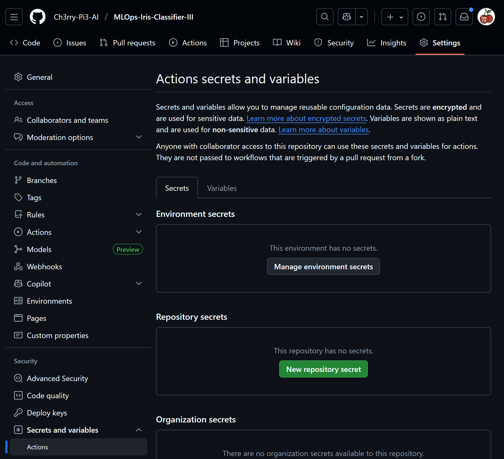

# 🚀 **Continuous Integration & Continuous Deployment - GitHub Actions**

This stage extends the **MLOps Iris Classifier III** project by introducing **GitHub Actions** for fully automated **Continuous Integration (CI)** and **Continuous Deployment (CD)**.
It builds your Flask-based Iris classifier into a Docker image, pushes it to **Google Artifact Registry**, and deploys it to **Google Kubernetes Engine (GKE)** — all triggered automatically when code is pushed to `main`.

<p align="center">
  
</p>

## 🧩 **Overview**

This completes a trilogy of CI/CD implementations for the same dataset:

| Stage | CI/CD Tool                      | Cloud Platform        | Deployment Method         |
| :---- | :------------------------------ | :-------------------- | :------------------------ |
| 1️⃣   | **CircleCI**                    | Google Cloud Platform | GKE via Artifact Registry |
| 2️⃣   | **GitLab CI/CD**                | Google Cloud Platform | GKE via Artifact Registry |
| 3️⃣   | **GitHub Actions** (this stage) | Google Cloud Platform | GKE via Artifact Registry |

The core cloud stack remains constant — **GCP**, **Artifact Registry**, and **Kubernetes Engine** — while each stage showcases a different automation framework.

## ⚙️ **Setup Instructions**

Follow these steps carefully to configure and run the GitHub Actions pipeline.

### 1️⃣ Install the GitHub Actions Extension in VS Code

Open the **Extensions** panel → search for **“GitHub Actions”** → install it to manage and debug workflows directly.

<p align="center">
  
</p>

### 2️⃣ Create Deployment Configuration Files

In your project root, add two new files.

#### 🐳 Dockerfile — container build definition

```dockerfile
FROM python:3.12
WORKDIR /app
COPY . /app
RUN pip install --no-cache-dir -e .
EXPOSE 5000
ENV FLASK_APP=app.py
CMD ["python", "app.py"]
```

#### ☸️ kubernetes-deployment.yaml — deployment and service

```yaml
apiVersion: apps/v1
kind: Deployment
metadata:
  name: mlops-iris-iii
spec:
  replicas: 2
  selector:
    matchLabels:
      app: mlops-iris-iii
  template:
    metadata:
      labels:
        app: mlops-iris-iii
    spec:
      containers:
        - name: mlops-iris-iii
          image: us-central1-docker.pkg.dev/sacred-garden-474511-b9/mlops-iris-iii/mlops-iris-iii:latest
          imagePullPolicy: Always
          ports:
            - containerPort: 5000
          resources:
            requests:
              cpu: "250m"
              memory: "256Mi"

apiVersion: v1
kind: Service
metadata:
  name: mlops-service
spec:
  selector:
    app: mlops-iris-iii
  ports:
    - protocol: TCP
      port: 80
      targetPort: 5000
  type: LoadBalancer
```

### 3️⃣ Add GitHub Secrets for GCP Access

1. Open your GitHub repo → **Settings** tab
2. Select **Secrets and variables → Actions**
3. Add these two secrets:

| Secret Name      | Value                                                |
| :--------------- | :--------------------------------------------------- |
| `GCP_PROJECT_ID` | Your GCP Project ID (e.g. `sacred-garden-474511-b9`) |
| `GCP_SA_KEY`     | Contents of your GCP Service Account JSON key        |

<p align="center">
  
</p>

### 4️⃣ Create the GitHub Actions Workflow

```
.github/
└── workflows/
    └── deploy.yml
```

Paste the full pipeline code into `deploy.yml`, commit, and push to `main`.

### 5️⃣ Run the Workflow

Go to the **Actions** tab → observe the workflow trigger.
A successful run looks like this:

<p align="center">
  
</p>

### 6️⃣ Verify Deployment on Google Cloud

Open **Google Cloud Console → Kubernetes Engine → Workloads** and locate `mlops-iris-iii`.

<p align="center">
  
</p>

Scroll to **Exposing services** to find the endpoint.

<p align="center">
  
</p>

Click the endpoint link to launch your live Flask application.

### 7️⃣ Test Your Deployed Application

Use the web UI to submit input and receive predictions from the Iris Classifier.

<p align="center">
  
</p>

## 📂 **Updated Project Structure**

```text
mlops_iris_classifier/
├── .venv/                          # 🧩 Local virtual environment (created by uv)
├── artifacts/
│   ├── raw/
│   │   └── data.csv                # 🌸 Input Iris dataset
│   ├── processed/                  # 💾 Preprocessed artefacts (from DataProcessing)
│   │   ├── X_train.pkl
│   │   ├── X_test.pkl
│   │   ├── y_train.pkl
│   │   └── y_test.pkl
│   └── models/                     # 🧠 Trained model and evaluation artefacts
│       ├── model.pkl
│       └── confusion_matrix.png
├── img/
│   ├── flask/
│   └── github_actions/
├── pipeline/
│   └── training_pipeline.py        # Executes data preparation + model training
├── src/
│   ├── __init__.py
│   ├── custom_exception.py         # Unified and detailed exception handling
│   ├── logger.py                   # Centralised logging configuration
│   ├── data_processing.py          # 🌱 Data preparation workflow
│   └── model_training.py           # 🌳 Model training and evaluation
├── static/                         # 🎨 Visual assets (used in Flask UI)
├── templates/                      # 🧩 Flask HTML templates (for app stage)
├── .github/
│   └── workflows/
│       └── deploy.yml              # 🚀 GitHub Actions CI/CD pipeline
├── .gitignore                      # 🚫 Git ignore rules
├── .python-version                 # 🐍 Python version pin
├── pyproject.toml                  # ⚙️ Project metadata and uv configuration
├── requirements.txt                # 📦 Python dependencies
├── setup.py                        # 🔧 Editable install support
├── Dockerfile                      # 🐳 Container build file
├── kubernetes-deployment.yaml      # ☸️ Kubernetes deployment definition
└── uv.lock                         # 🔒 Locked dependency versions
```

## 🌈 **Outcome**

After completing this stage, your **MLOps Iris Classifier** deploys automatically to **GKE** through **GitHub Actions** — no manual steps required.
Every push to `main` triggers a rebuild, container push, and Kubernetes rollout, ensuring continuous, reproducible delivery.

With this, you have successfully completed all three CI/CD implementations — **CircleCI**, **GitLab CI**, and **GitHub Actions** — each integrated seamlessly with Google Cloud Platform.
