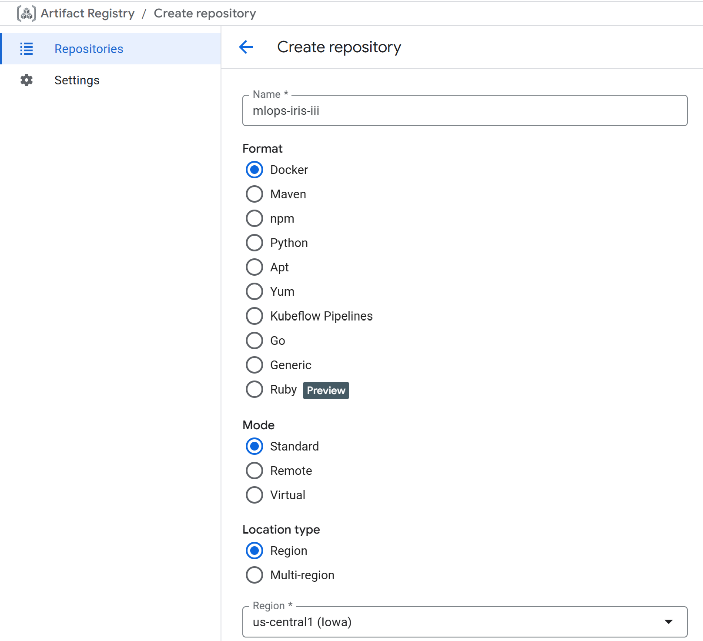
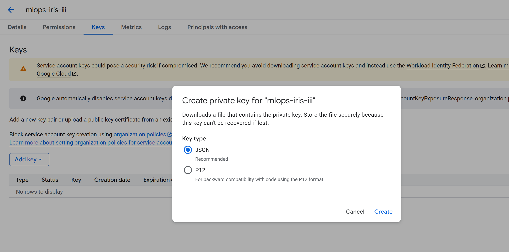

# ☁️ **Google Cloud Platform (GCP) Setup — MLOps Iris Classifier**

This stage introduces **Google Cloud Platform (GCP)** configuration for the **MLOps Iris Classifier** project.
The setup prepares the cloud infrastructure necessary for deploying containerised applications and machine learning workflows using **Kubernetes (GKE)**, **Artifact Registry**, and **Service Accounts** with secure IAM permissions.

By completing this setup, your environment will be ready to build, store, and deploy Docker containers directly from your CI/CD pipelines (such as CircleCI or GitLab CI) into **GKE Autopilot** within the **us-central1 (Iowa)** region.

## 🌐 **Overview**

This GCP configuration involves five key steps:

1. Enabling the required APIs
2. Creating an Artifact Registry repository
3. Setting up a Service Account and JSON key
4. Creating a Kubernetes Autopilot cluster
5. Ensuring consistent region and network configuration

Each step ensures the environment is secure, aligned, and ready for MLOps deployment.

## 1️⃣ Enable Required APIs

Go to your [Google Cloud Console](https://console.cloud.google.com) and open the **Navigation Menu → APIs & Services → Library**.

Use the search bar to confirm that the following APIs are **enabled**:

* Kubernetes Engine API
* Google Container Registry API
* Compute Engine API
* Identity and Access Management (IAM) API
* Cloud Build API
* Cloud Storage API

When an API is correctly enabled (for example, *Kubernetes Engine API*), you should see a confirmation like this:

  

## 2️⃣ Create an Artifact Registry Repository

Return to the GCP landing page and **search for “Artifact Registry”**.
Click **+ Create Repository** and complete the following fields:

* **Repository name:** `mlops-iris-iii`
* **Region:** `us-central1 (Iowa)`
* Keep all other settings as default.
* Scroll to the bottom and click **Create**.

  

This repository will store Docker images and related artefacts used in deployment.

## 3️⃣ Create a Service Account

Return to the **Navigation Menu → IAM & Admin → Service Accounts**.
Click **+ Create Service Account** and name it `mlops-iris-iii`.

Under **Permissions (optional)**, assign the following permissions:

  

Click **Create**. Once complete, you will see your new service account listed.

Next, click the **Actions** button (on the far right of the row) and choose **Manage Keys**.
Select **Add Key → Create new key**, then choose **JSON** as the key type.

  

Click **Create** to download your JSON key file.
This file will be used later to authenticate your cloud resources and pipelines.

## 4️⃣ Create a Kubernetes Autopilot Cluster

Return to the GCP landing page and search for **Kubernetes Engine**.
From the left-hand pane, select **Clusters**.

  

Click **Create Cluster**.
When prompted, select the **Autopilot** mode (the default option):

  

In the **Cluster basics** section, keep the defaults:

* **Cluster name:** `autopilot-cluster-1`
* **Region:** `us-central1` (must match your Artifact Registry region)

Leave **Fleet Registration** settings unchanged.

In the **Networking** section, ensure both of the following are selected:

* **Access using DNS**
* **Access using IPv4 addresses**

  

Keep the **Advanced settings** as default and click **Create**.

The cluster creation process will take several minutes.
Wait until it is fully provisioned before proceeding to any deployment or pipeline integration.

## ✅ **In Summary**

At the end of this stage:

* All essential GCP APIs are active.
* A secure **Artifact Registry** repository (`mlops-iris-iii`) has been created.
* A **Service Account** with JSON credentials is available for authentication.
* A fully managed **Autopilot Kubernetes cluster** (`autopilot-cluster-1`) has been provisioned in `us-central1`.

This setup completes the cloud infrastructure foundation for the **MLOps Iris Classifier** project and prepares it for container deployment, CI/CD integration, and future scalability across GCP services.